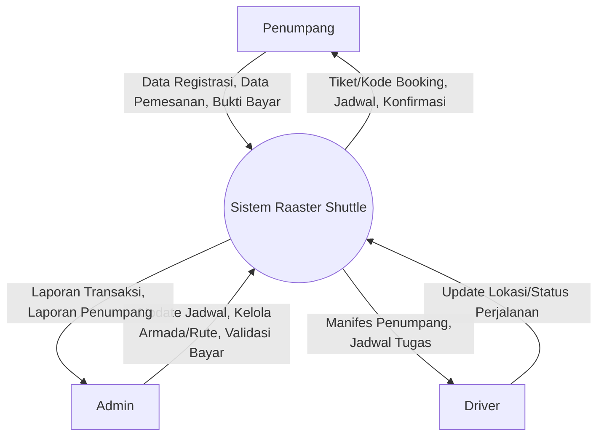
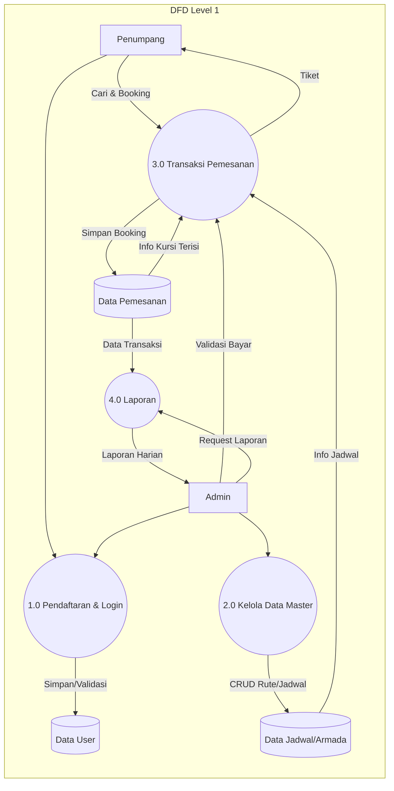
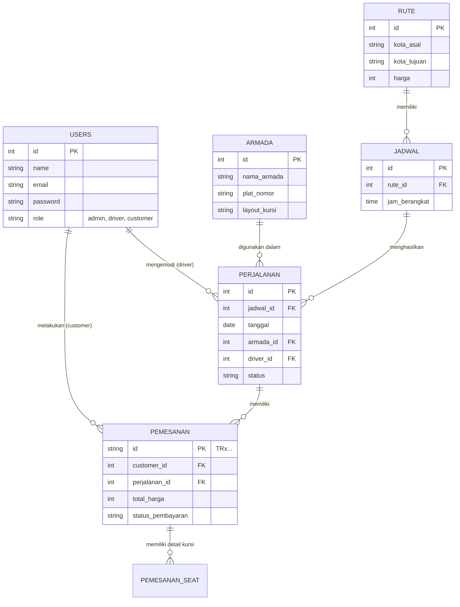
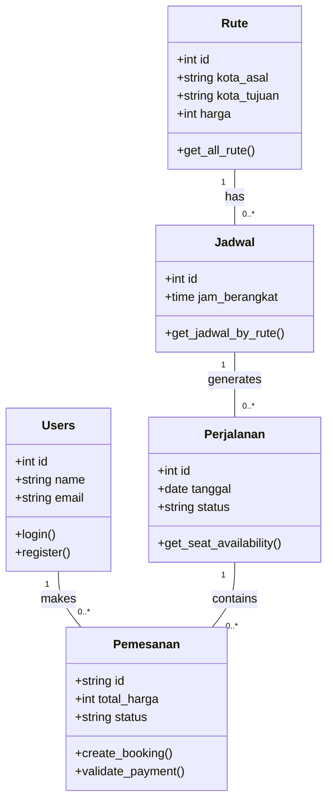
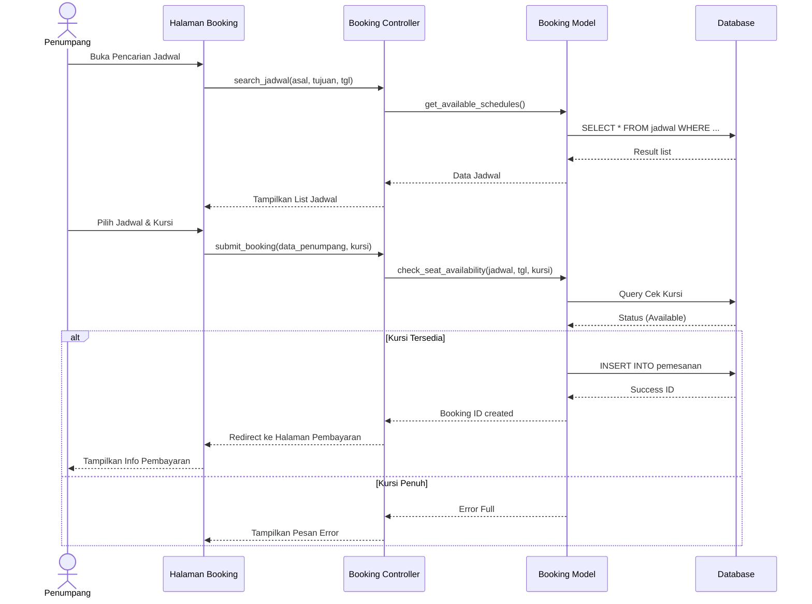

# Laporan Analisis dan Perancangan Sistem Raaster Shuttle

## Bagian 1 — Konsep Dasar Sistem

### 1. Definisi Sistem, Analisis, dan Perancangan
**a. Sistem**
Sistem adalah sekumpulan elemen atau komponen yang saling berinteraksi, bergantung satu sama lain, dan terpadu untuk mencapai suatu tujuan tertentu. Dalam konteks **Raaster Shuttle**, sistem ini merupakan integrasi antara perangkat lunak (website), perangkat keras (server/gadget), prosedur (SOP pemesanan), dan pengguna (admin, driver, penumpang) untuk memfasilitasi layanan transportasi.

**b. Analisis Sistem**
Analisis sistem adalah proses mempelajari prosedur atau sistem bisnis yang berjalan saat ini untuk mengidentifikasi masalah, peluang perbaikan, dan kebutuhan pengguna. Tujuannya adalah menentukan *apa* yang harus dilakukan sistem baru untuk mengatasi masalah seperti pencatatan manual dan kehilangan data.

**c. Perancangan Sistem**
Perancangan sistem adalah tahap setelah analisis, di mana spesifikasi kebutuhan diterjemahkan ke dalam bentuk teknis. Ini mencakup perancangan struktur data (database), antarmuka pengguna (UI/UX), dan arsitektur perangkat lunak untuk membangun solusi yang diinginkan.

**d. Manfaat Penerapan Sistem Informasi Raaster Shuttle**
1.  **Efisiensi Operasional**: Menggantikan pencatatan manual (buku tulis) dengan database digital, mengurangi risiko *human error*.
2.  **Kemudahan Akses**: Penumpang dapat melihat jadwal dan memesan tiket kapan saja dan di mana saja melalui website.
3.  **Keamanan Data**: Data pemesanan dan penumpang tersimpan aman di server, meminimalisir risiko kehilangan buku catatan.
4.  **Laporan Real-time**: Manajemen dapat melihat laporan pendapatan dan okupansi kursi secara langsung tanpa rekap manual.

---

## Bagian 2 — Analisis Masalah & Kebutuhan Sistem

### 1. Identifikasi Masalah Sistem Berjalan (Manual)
1.  **Kehilangan Data**: Penggunaan buku tulis rentan terhadap kerusakan fisik, hilang, atau terselip, yang mengakibatkan hilangnya riwayat transaksi.
2.  **Pencatatan Ganda (Double Booking)**: Tanpa sistem terpusat, admin yang berbeda mungkin menjual kursi yang sama kepada dua orang berbeda, menyebabkan konflik saat keberangkatan.
3.  **Inefisiensi Waktu**: Proses pengecekan ketersediaan kursi memakan waktu lama karena admin harus membolak-balik halaman buku log secara manual.

### 2. Tujuan Sistem Baru
Membangun aplikasi berbasis website yang dapat mengelola pemesanan tiket, penjadwalan armada, dan manajemen data penumpang secara terkomputerisasi, akurat, dan *real-time* untuk meningkatkan pelayanan dan efisiensi manajemen Raaster Shuttle.

### 3. Batasan Sistem
1.  Sistem berbasis **Web** (dapat diakses via browser Mobile/Desktop).
2.  Mencakup proses: Registrasi/Login, Pencarian Jadwal, Pemilihan Kursi, Pemesanan, dan Konfirmasi Pembayaran.
3.  Pembayaran dilakukan melalui transfer bank dengan konfirmasi manual atau otomatis (sesuai pengembangan).
4.  Sistem menangani operasional Shuttle (Point-to-Point) antar kota.

### 4. Spesifikasi Kebutuhan Fungsional (Functional Requirements)
1.  **Fitur Autentikasi**: Sistem harus memungkinkan pengguna (Admin, Driver, Penumpang) untuk Login dan Registrasi.
2.  **Manajemen Jadwal & Rute**: Admin dapat menambah, mengubah, dan menghapus data rute, armada (bus/shuttle), dan jadwal keberangkatan.
3.  **Pencarian Tiket**: Penumpang dapat mencari jadwal berdasarkan Kota Asal, Kota Tujuan, dan Tanggal.
4.  **Pemesanan & Pemilihan Kursi**: Penumpang dapat memilih kursi yang tersedia secara visual (denah kursi) dan melakukan pemesanan.
5.  **Manajemen Transaksi**: Sistem dapat mencatat status pembayaran (Pending, Lunas) dan memvalidasi pesanan.
6.  **Laporan**: Sistem dapat menghasilkan laporan transaksi, jumlah penumpang per perjalanan, dan pendapatan harian/bulanan.
7.  **Manajemen Driver**: Sistem dapat melacak dan mengelola data driver serta penugasan armada.

### 5. Spesifikasi Kebutuhan Non-Fungsional
1.  **Usability**: Antarmuka harus *user-friendly* dan responsif (dapat diakses dengan baik di HP maupun Laptop).
2.  **Performance**: Pencarian jadwal dan proses booking harus selesai dalam waktu kurang dari 5 detik.
3.  **Availability**: Sistem harus tersedia 24/7 untuk melayani pemesanan tiket kapan saja.
4.  **Security**: Password pengguna harus terenkripsi (misal: BCrypt) dan halaman admin terlindungi dari akses tidak sah.

---

## Bagian 3 — Analisis Proses Sistem

### 1. Context Diagram (Level 0 DFD)
Menunjukkan aliran data antara entitas luar dan Sistem Informasi Raaster Shuttle.



### 2. Data Flow Diagram (DFD) Level 1
Memecah sistem menjadi proses-proses utama.



---

## Bagian 4 — Perancangan Basis Data

### 1. Entity Relationship Diagram (ERD) Notation
Entitas utama dalam sistem disesuaikan dengan studi kasus Raaster Shuttle:

*   **Users** (Menyimpan data Admin, Driver, dan Customer)
*   **Armada** (Data kendaraan/shuttle)
*   **Rute** (Data kota asal, tujuan, dan harga)
*   **Jadwal** (Master jadwal keberangkatan dan hari operasional)
*   **Perjalanan** (Instance harian dari jadwal, menghubungkan tanggal spesifik dengan driver & armada)
*   **Pemesanan** (Transaksi tiket penumpang)

### 2. Relasi Antar Tabel & Skema Database


### 3. Normalisasi (3NF)
Database dirancang mencapai bentuk normal ke-3 (3NF):
*   **1NF**: Semua atribut bernilai atomik (tidak ada *repeating groups*). Contoh: Data kursi tidak disimpan sebagai string "1,2,3" di tabel Pemesanan, melainkan dipisah ke tabel `pemesanan_seat`.
*   **2NF**: Semua atribut non-kunci bergantung penuh pada *Primary Key*. Contoh: `harga` bergantung pada `Rute`, bukan pada `Pemesanan` secara langsung (meski `Pemesanan` menyimpan snapshot harga saat transaksi).
*   **3NF**: Tidak ada ketergantungan transitif. Atribut non-kunci tidak bergantung pada atribut non-kunci lain. Contoh: Nama Armada tidak disimpan di tabel `Perjalanan`, cukup `armada_id`. Detail armada ada di tabel `Armada`.

---

## Bagian 5 — Perancangan UML

### A. Use Case Diagram
Menggambarkan interaksi aktor dengan fungsionalitas sistem.

```mermaid
usecaseDiagram
    actor "Penumpang" as P
    actor "Admin" as A
    actor "Driver" as D
    
    package "Sistem Raaster Shuttle" {
        usecase "Login / Registrasi" as UC1
        usecase "Cari Jadwal" as UC2
        usecase "Pesan Tiket & Pilih Kursi" as UC3
        usecase "Pembayaran" as UC4
        usecase "Kelola Rute & Jadwal" as UC5
        usecase "Kelola Armada" as UC6
        usecase "Lihat Laporan" as UC7
        usecase "Lihat Jadwal Tugas" as UC8
    }

    P --> UC1
    P --> UC2
    P --> UC3
    UC3 ..> UC2 : include
    P --> UC4
    
    A --> UC1
    A --> UC5
    A --> UC6
    A --> UC7
    
    D --> UC1
    D --> UC8
```

### B. Activity Diagram (Alur Peminjaman/Pemesanan Buku -> Tiket)
Flowchart proses pemesanan tiket oleh penumpang.

```mermaid
graph TD
    Start((Mulai)) --> Login{Sudah Login?}
    Login -- Tidak --> FormLogin[Input Username & Password]
    FormLogin --> Validasi{Valid?}
    Validasi -- Tidak --> FormLogin
    Validasi -- Ya --> Dashboard
    Login -- Ya --> Dashboard
    
    Dashboard --> Cari[Cari Jadwal (Asal, Tujuan, Tanggal)]
    Cari --> List[Tampil Daftar Jadwal]
    List --> Pilih[Pilih Jadwal & Armada]
    Pilih --> Kursi[Pilih Nomor Kursi Tersedia]
    
    Kursi --> FormData[Isi Detail Penumpang]
    FormData --> Checkout[Konfirmasi Pesanan]
    Checkout --> Bayar[Lakukan Pembayaran]
    
    Bayar --> ValidasiBayar{Validasi Admin/Sistem}
    ValidasiBayar -- Gagal --> Batal[Pemesanan Dibatalkan]
    ValidasiBayar -- Sukses --> Tiket[Tiket Terbit / Status Lunas]
    
    Tiket --> Finish((Selesai))
```

### C. Class Diagram
Representasi struktur kelas dalam kode program (Model).



### D. Sequence Diagram
Detil interaksi objek untuk proses **Pemesanan Tiket**.


