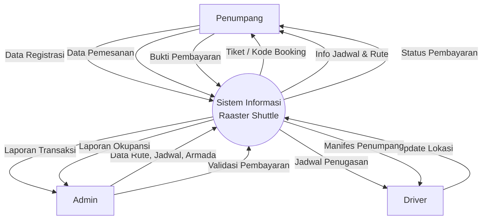
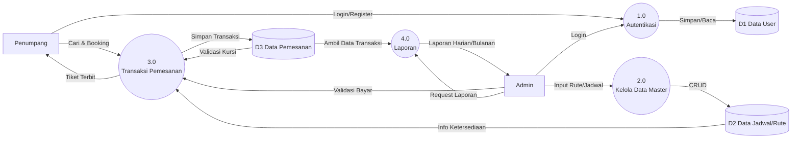
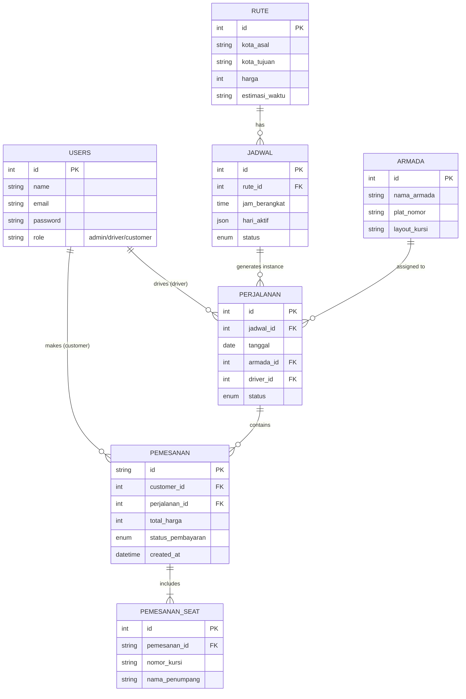
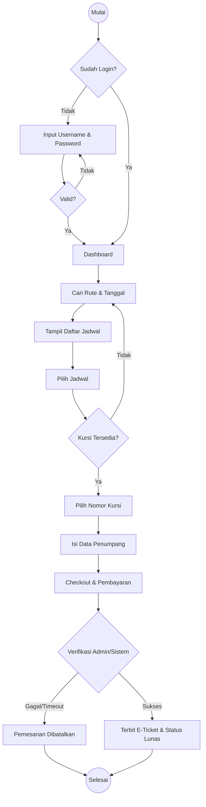
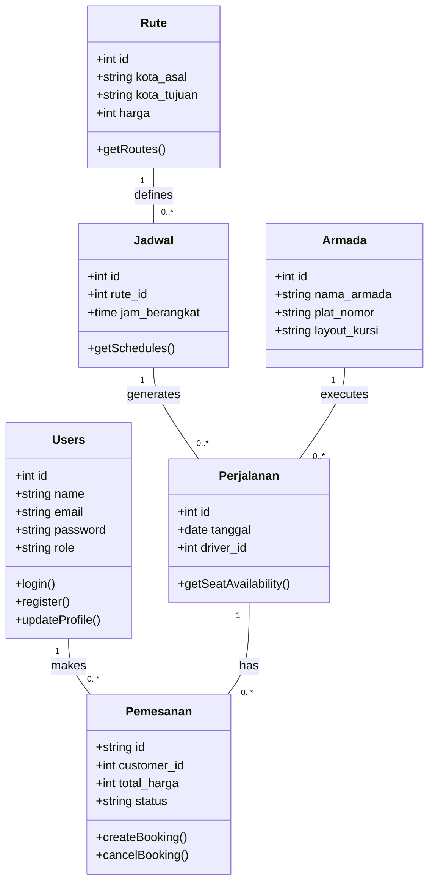
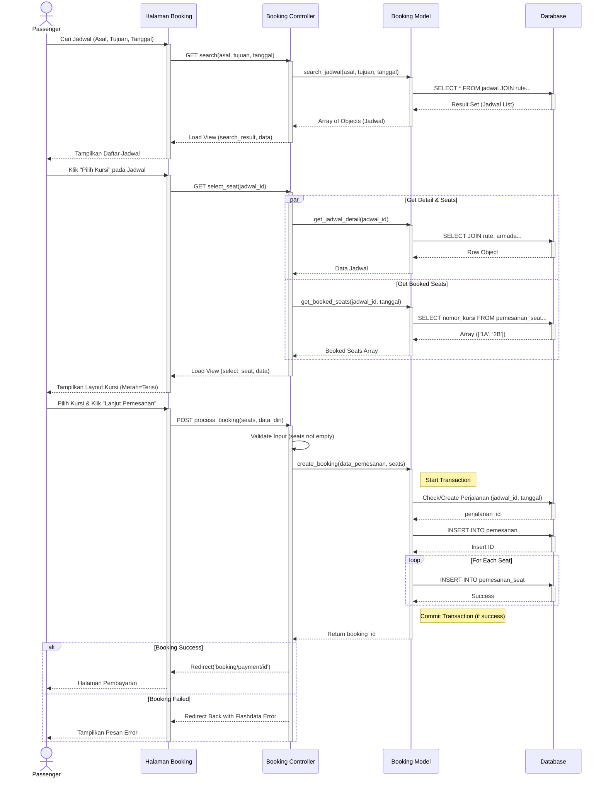

# System Diagrams - Raaster Shuttle
## 1. Context Diagram (DFD Level 0)



---

## 2. Data Flow Diagram (DFD Level 1)



---

## 3. Entity Relationship Diagram (ERD)



---

## 4. Use Case Diagram

```mermaid
usecaseDiagram
    actor "Passenger" as P
    actor "Admin" as A
    actor "Driver" as D

    package "Raaster Shuttle System" {
        usecase "Login / Registrasi" as UC1
        usecase "Cari Jadwal" as UC2
        usecase "Pesan Tiket & Pilih Kursi" as UC3
        usecase "Pembayaran" as UC4
        usecase "Kelola Rute & Jadwal" as UC5
        usecase "Kelola Armada" as UC6
        usecase "Lihat Laporan" as UC7
        usecase "Update Lokasi / Status" as UC8
        usecase "Lihat Manifes" as UC9
    }

    %% Passenger
    P --> UC1
    P --> UC2
    P --> UC3
    UC3 ..> UC2 : <<include>>
    P --> UC4

    %% Admin
    A --> UC1
    A --> UC5
    A --> UC6
    A --> UC4 : "Validasi"
    A --> UC7

    %% Driver
    D --> UC1
    D --> UC8
    D --> UC9
```

---

## 5. Activity Diagram (Alur Pemesanan Tiket)



---

## 6. Class Diagram



---

## 7. Sequence Diagram (Proses Booking Tiket)



---
